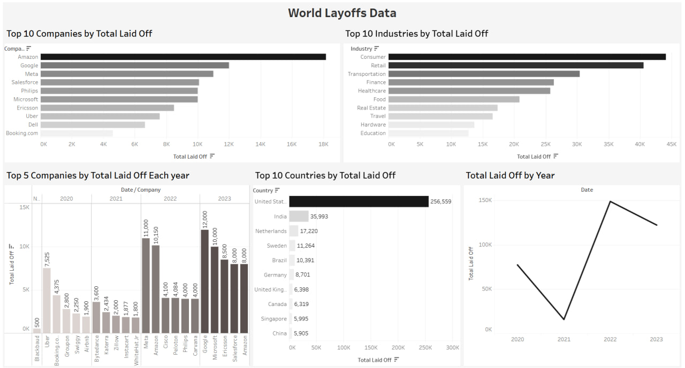

# Layoffs Data Cleaning & Exploratory Data Analysis

## Project Overview

This project focuses on cleaning, standardizing, validating, and analyzing a layoffs dataset using SQL and MySQL.

The project demonstrates a practical SQL data cleaning workflow followed by exploratory data analysis to identify trends and patterns in employee layoffs across companies, industries, countries, and time periods.

## Tools

- MySQL
- MySQL Workbench
- SQL

## Data Cleaning

The dataset was cleaned through the following steps:

- Created staging tables to preserve the original dataset
- Identified and removed duplicate records
- Standardized company names and text values
- Standardized industry and country values
- Converted date values from text to DATE format
- Handled NULL and blank values
- Filled missing industry values using matching company records
- Removed records where both total layoffs and layoff percentage were missing

## Exploratory Data Analysis

The analysis includes:

- Maximum layoffs and layoff percentages
- Companies that laid off 100% of their workforce
- Total layoffs by company
- Total layoffs by industry
- Total layoffs by country
- Total layoffs by year
- Total layoffs by company stage
- Monthly layoffs
- Rolling total of layoffs over time
- Company-level yearly analysis
- Yearly company rankings
- Top 5 companies by layoffs for each year

## SQL Techniques Used

- CTEs
- Window Functions
- ROW_NUMBER()
- DENSE_RANK()
- PARTITION BY
- Aggregate Functions
- Self JOIN
- Date Functions
- String Functions
- GROUP BY
- HAVING
- Data Type Conversion
- Data Cleaning

## Tableau Dashboard

The cleaned World Layoffs data was visualized using Tableau Public to create an interactive dashboard covering Total Layoff by Companies, Total Layoff by industries, Total Layoff for each year, Total Layoff by Country, Total Laid Off by Year.
[View Interactive Tableau Dashboard](https://public.tableau.com/app/profile/mohab.adel/viz/WorldLayoffsData/Dashboard1?publish=yes)


## Project Structure

```text
layoffs-data-cleaning-sql/
├── README.md
├── layoffs_data_cleaning.sql
└── layoff.jpg
├── layoffs_eda.sql
└── layoffs.csv

## Conclusion

This project demonstrates practical SQL skills for data cleaning and exploratory analysis, including duplicate handling, data standardization, missing value treatment, date transformation, ranking, rolling totals, and time-based analysis.

